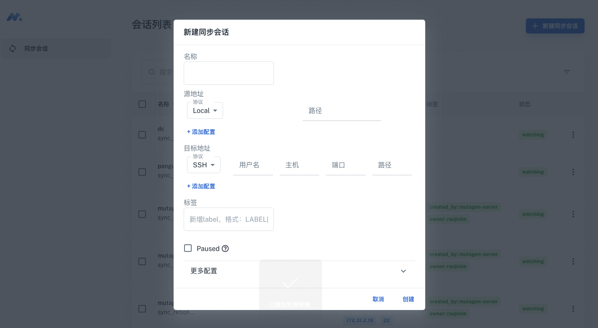

# Mutagen App

mutagen app是一个渐进式Web应用，为mutagen提供web ui可以创建、删除、监控会话。

感谢 Minimal [(Free version)](https://minimal-kit-react.vercel.app/) 的精美模板。

## 使用

- 推荐 `node js 16.x`
- 安装依赖: `npm install` / `yarn install`
- 启动: `npm run start` / `yarn start`

## 截图

